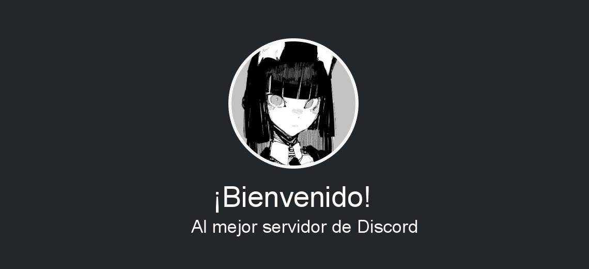

<center> <h1>NeeKuro</h1> </center>
<center>de <b>Kmz Kuro</b> en nombre de <b>NexaTDC</b></center>
<center>creada apartir de <b>cacao_nekoapi</b> y <b>nekoapi.beta</b> en npm.js</center>
<br>
<center>
<<<<<<< HEAD


=======
<p>

>>>>>>> cdc766577bbe8e1f256cd13c8c514e994eb2458e

</p>
</center>

### ¿Qué es "NeeKuro"?

NeeKuro es una biblioteca de imágenes con temática de anime para bots de Discord e imagenes de bienvenida.

Principalmente se creo con el fin de ser unicamente para <b>Maple Bot</b>. Sin embargo, desde que se decidio hacer a Maple de codigo publico, tambien se decidio que tanto su API como paquete fuesen libres.

> notas: el paquete puede contener errores ya que se encuentra en fase beta, la API se hostea de manera gratuita por lo que las solicitudes no siempre pueden estar disponibles.

## Instalacion

```sh
npm install neekuro
```

## Ejemplos

NeeKuro es un paquete que requiere de un token para llevar a cabo sus sollicitudes, por lo que requieres de ir a la [API Oficial](https://www.nexatdc.work.gd/api/) para poder generar un token.

### primeros pasos
1 - Instanciamiento de usuario y establecimiento del token.<br>Este paso se requiere ya que con ello se establece globalmente el token por el paquete
<hr>

```javascript
require('dotenv').config();
// importacion del paquete neekuro
const neekuro = require('neekuro');

// instanciamiento del usuario
const user = new neekuro.User();

// establecimiento del token
user.token(process.env['ApiToken'])
```
<hr>

#### Peticion de imagenes simple
Una vez estableciste el token puedes comenzar a pedir imagenes

```javascript

const neekuro = require('neekuro');

/**
 * Codigo de usuario
 */

// es necesario escribir todo siempre dentro de una funcion asincrona
async function ObtenerImagen() {
    // obtenemos un gif con el metodo getGif de SFW
    const cuddle = await neekuro.SFW.getGif('action', 'cuddle');
    
    // imprimimos la url y el anime del gif
    console.log(cuddle.getUrl(), cuddle.getAnime())
}

// ejecutamos la funcion
ObtenerImagen();

// nota: no te aguites por el gif y subcategoria, todo viene en documentado con typescript, solo tienes que completar los pasos :)
```
#### Ejemplo de imagenes de bienvenida
Las imagenes de bienvenida son otra de las alternativas que otorga NeeKuro, puedes hacer una imagen de la siguiente manera:
```javascript
// obtenemos directamente la clase del paquete
const { Welcome } = require('neekuro');
const fs = require('fs');

// Configuración básica, añade un avatar titulo y descripción
const welcome = new Welcome()
  .setAvatar('https://ejemplo.com/avatar.jpg')
  .setTitle('¡Bienvenido!')
  .setDescription('Al servidor de Discord');

// Genera y guarda la imagen
welcome.build()
  .then(image => fs.writeFileSync('bienvenida.png', image))
  .then(() => console.log('Imagen creada correctamente!'))
  .catch(err => console.error('Error:', err.message));

// nota: como antes, todo viene bien documentado en el paquete, solo sigue los pasos y explora por ti ;3
```
<hr>
<center>
<p>Resultado esperado</p>

</center>

## Contenido

Lo siguente es lo que contiene (o contendra) el paquete

| Categoria | Descripción | |
|-|-|-|
| Sfw | Contenido de roleplay no nsfw | en desarrollo
| Nsfw | Contenido +18 general y roleplay | no comenzada

## Finalmente....

Tanto la API, paquete y bot se encuentran en desarrollo, ante todo te pedimos la mayor de las paciencias, te aseguraremos que el resultado te gustará! :'3

Finalmente te agradecemos tu preferencia y esperamos haber cumplido tus espectativas ;)
<br><br><hr>

### que se tiene planeado?

Principalmente terminaremos la categoria acción y reacción para tener la primer subida a NPM de este paquete y asi finalmente tener terminada la categoria SFW. <br> Sin embargo una de las problematicas que se nos presentan son buscar los gifs para la API asi como sus animes <b>es un proceso lento...</b> y agobiante...
<br>Por eso ahora mas que nunca queremos que nos apoyes en <b>NexaTDC</b>! Con el fin de poder dar al publico lo mas pronto posible los servicios que Maple Bot ofrece.

<b><i>No es para mi, es para la comunidad... Si no es para la comunidad, no es para nadie...</i></b>
<i>- NexaTDC</i>
<br><br><br><br>
CC. Creative Commons 2025 - @CacaoNk0027
